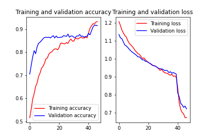

## Table of contents
* [General Information](#general)
* [Data](#data)
* [Transfer Learning](#transfer_learning)
* [Results](#results)
* [References](#ref)

## General information
This project is an application of transfer learning on identifying Pneumonia in Chest X-rays. Its a binary classification problem with the classes "Normal" and "Pneumonia". The classes are highly unbalanced, with the class "Normal" being under-represented. This issue is being tackled using minority oversampling with blurring and brightness transformations for the minority class "Normal".      

### Python modules:
- keras
- numpy
- PIL
- os
- pickle
- pathlib
- matplotlib
- random

### Scripts:
- **add_images.py**: Obtain 326 additional normal Chest X-rays from the Shenzhen set.
- **oversample.py**: Perform minority oversampling with an image transformation.
- **training.py**: Specifying model architecture and training.

## Data
For this project, the [Chest X-Ray Images (Pneumonia)](https://www.kaggle.com/paultimothymooney/chest-xray-pneumonia) Kaggle dataset was used. Additional images for the minority class "Normal" were collected from the Shenzhen set, which is a Chest X-ray database created by the National Library of Medicine, Maryland, USA in collaboration with Shenzhen No.3 People’s Hospital, Guangdong Medical College, Shenzhen, China.

Since the data are highly unbalanced even after we included additional images, the next step was to apply minority oversampling for the under-represented class "Normal". In order to avoid possible overfitting issues, two transformations were introduced during oversampling, a box blur transformation and a brightness enhancer. This is an easy way of introducing a bit of variation in the oversampled images instead of just copying them. Therefore for each oversampled image, either blurring or brightness enhancing is applied.

The choice of these two transformations derives from the nature of the images. Xrays have varying brightness levels and some look slightly more blurred than others. However the transformations were mild, so that the image still looks like a regular xray and does not become too distorted.   

## Transfer Learning
We use the pre-trained VGG16 network as the base model and add a new neural network on top. Its architecture can be seen in Table 1:

<table>
    <caption>Table 1: Model Architecture</caption>
    <thead>
      <tr>
        <th>Layer</th>
        <th>Activation</th>
      </tr>
    </thead>
    <tbody>
        <tr>
            <td>Flat layer</td>
            <td>-</td>
        </tr>
        <tr>
            <td>Dropout (10%)</td>
            <td>-</td>
        <tr>
            <td>Regularized fully connected layer (256 nodes)</td>
            <td>Relu</td>
        <tr>
            <td>Dropout (20%)</td>
            <td>-</td>
        <tr>
            <td>Output layer</td>
            <td>Sigmoid</td>
        <tr>
        </tr>
    </tbody>
  </table>

Stochastic gradient descent is used as an optimizer, with a learning rate of 0.0001. Dropout layers and regularization (L2) are two useful ways of preventing overfitting. 

First we freeze the base model and only update the weights of the new layers on top until they reach convergence (validation loss stops decreasing). Finally, we fine-tune the whole model by unfreezing the layers of the last block of the VGG16 network and continue training with a very small learning rate. That way, the convolutional layers of the final block of the VGG16 model will become more specific to our problem, therefore improving the performance.   

## Results

The above Figure shows the accuracy and loss on the training and validation sets. The top network described in Table 1 was trained for 40 epochs, while the layers of the base model were frozen. Then the last block of the base model was fine tuned along with the top network for a few additional epochs. Especially on the left panel, one can notice that the validation accuracy is higher than the training accuracy, almost throughout the whole training process. This could be related to the use of Dropout layers by the top network. During validation the Dropout layers do not have an effect, therefore the top network gets to use more neurons that may eventually increase its performance. However, it could also be related to the validation data. Its possible that the validation images have less variation compared to the training images, making the validation set "easier" to classify.   

## References
1) Jaeger S, Karargyris A, Candemir S, Folio L, Siegelman J, Callaghan F, Xue Z, Palaniappan K, Singh RK, Antani S, Thoma G, Wang YX, Lu PX, McDonald CJ.  Automatic tuberculosis screening using chest radiographs. IEEE Trans Med Imaging. 2014 Feb;33(2):233-45. doi: 10.1109/TMI.2013.2284099. PMID: 24108713

2) Candemir S, Jaeger S, Palaniappan K, Musco JP, Singh RK, Xue Z, Karargyris A, Antani S, Thoma G, McDonald CJ. Lung segmentation in chest radiographs using anatomical atlases with nonrigid registration. IEEE Trans Med Imaging. 2014 Feb;33(2):577-90. doi: 10.1109/TMI.2013.2290491. PMID: 24239990
